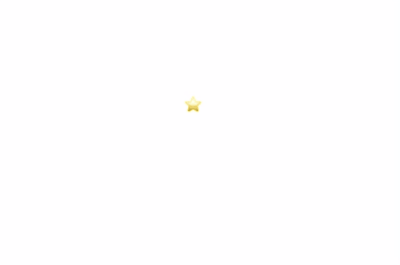
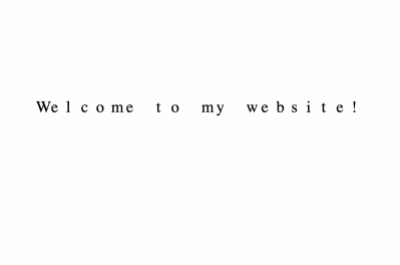
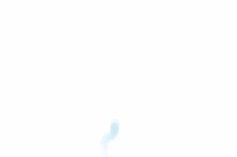

# <mouse-trail\>

Party like it's 1999: add a trail to your mouse.

## 📦 Install it

```
npm i @erikkroes/mouse-trail
```

## 🛠️ Use it 

Preferably, don't. You will turn your visitors into archenemies.

```
<script async type="module" src="mouse-trail.js"></script>

<mouse-trail>✨</mouse-trail>
```

## 🏅 3 amazing variations

### Follow (Default)

```<mouse-trail follow count="15">⭐</mouse-trail>```



### Banner

```<mouse-trail banner>Welcome to my website!</mouse-trail>```



### Drop 

```<mouse-trail drop>❄️</mouse-trail>```

